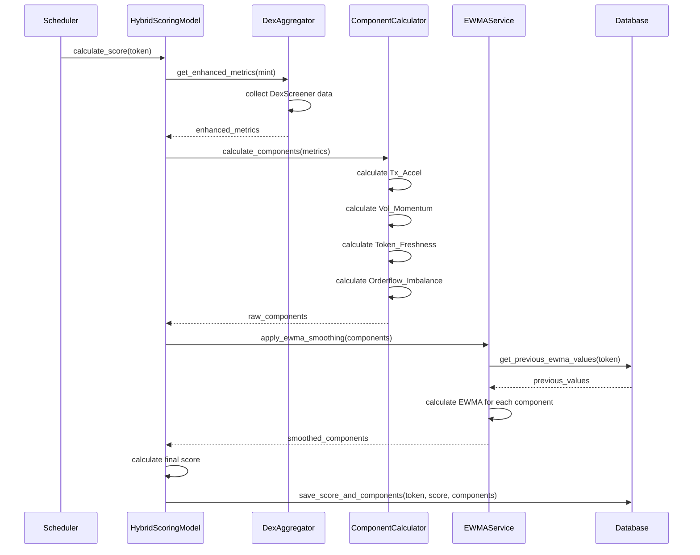

# Design Document

## Overview

This design document outlines the implementation of the new "Hybrid Momentum" scoring model for the To The Moon token scoring system. The new model replaces the current simple scoring algorithm with a sophisticated multi-component formula that captures transaction acceleration, volume momentum, token freshness, and orderflow imbalance to better identify short-term arbitrage opportunities.

## Architecture

### High-Level Architecture

The new scoring system maintains the existing clean architecture pattern while introducing new components:

```
┌─────────────────────────────────────────────────────────────┐
│                    Application Layer                        │
│  ┌─────────────────┐  ┌─────────────────┐  ┌─────────────┐ │
│  │   API Routes    │  │  Admin Panel    │  │ Scheduler   │ │
│  └─────────────────┘  └─────────────────┘  └─────────────┘ │
└─────────────────────────────────────────────────────────────┘
                                │
┌─────────────────────────────────────────────────────────────┐
│                     Domain Layer                            │
│  ┌─────────────────┐  ┌─────────────────┐  ┌─────────────┐ │
│  │ Hybrid Momentum │  │ EWMA Smoothing  │  │ Component   │ │
│  │ Scoring Model   │  │    Service      │  │ Calculator  │ │
│  └─────────────────┘  └─────────────────┘  └─────────────┘ │
└─────────────────────────────────────────────────────────────┘
                                │
┌─────────────────────────────────────────────────────────────┐
│                    Adapter Layer                            │
│  ┌─────────────────┐  ┌─────────────────┐  ┌─────────────┐ │
│  │ Enhanced DEX    │  │   Database      │  │  Settings   │ │
│  │   Aggregator    │  │  Repository     │  │  Service    │ │
│  └─────────────────┘  └─────────────────┘  └─────────────┘ │
└─────────────────────────────────────────────────────────────┘
```

### Component Interaction Flow



## Components and Interfaces

### 1. Hybrid Momentum Scoring Model

**Location:** `src/domain/scoring/hybrid_momentum_model.py`

```python
class HybridMomentumModel:
    def __init__(self, settings_service: SettingsService, ewma_service: EWMAService):
        self.settings = settings_service
        self.ewma = ewma_service
    
    def calculate_score(self, token: Token, metrics: dict) -> ScoringResult:
        """Calculate hybrid momentum score with EWMA smoothing"""
        
    def calculate_components(self, metrics: dict, token_created_at: datetime) -> ComponentResult:
        """Calculate raw scoring components"""
        
    def get_weights(self) -> WeightConfig:
        """Get current weight configuration from settings"""
```

**Key Methods:**
- `calculate_tx_accel(tx_count_5m, tx_count_1h) -> float`
- `calculate_vol_momentum(volume_5m, volume_1h) -> float`
- `calculate_token_freshness(created_at, threshold_hours) -> float`
- `calculate_orderflow_imbalance(buys_volume_5m, sells_volume_5m) -> float`

### 2. EWMA Smoothing Service

**Location:** `src/domain/scoring/ewma_service.py`

```python
class EWMAService:
    def __init__(self, repository: TokenScoreRepository):
        self.repository = repository
    
    def apply_smoothing(self, token_id: int, raw_components: dict, alpha: float) -> dict:
        """Apply EWMA smoothing to all components and final score"""
        
    def get_previous_values(self, token_id: int) -> Optional[dict]:
        """Get previous EWMA values for a token"""
        
    def calculate_ewma(self, current: float, previous: Optional[float], alpha: float) -> float:
        """Calculate single EWMA value"""
```

### 3. Enhanced DEX Aggregator

**Location:** `src/domain/metrics/enhanced_dex_aggregator.py`

Extends existing `dex_aggregator.py` to collect additional metrics:

```python
def aggregate_enhanced_metrics(mint: str, pairs: list[dict], created_at: datetime) -> dict:
    """
    Collect enhanced metrics including:
    - tx_count_5m, tx_count_1h (from DexScreener txns)
    - volume_5m, volume_1h (from DexScreener volume)
    - buys_volume_5m, sells_volume_5m (estimated from ratios)
    - hours_since_creation (calculated from created_at)
    """
```

### 4. Component Calculator

**Location:** `src/domain/scoring/component_calculator.py`

```python
class ComponentCalculator:
    @staticmethod
    def calculate_tx_accel(tx_count_5m: float, tx_count_1h: float) -> float:
        """(tx_count_5m / 5) / (tx_count_1h / 60)"""
        
    @staticmethod
    def calculate_vol_momentum(volume_5m: float, volume_1h: float) -> float:
        """volume_5m / (volume_1h / 12)"""
        
    @staticmethod
    def calculate_token_freshness(hours_since_creation: float, threshold_hours: float = 6.0) -> float:
        """max(0, (threshold_hours - hours_since_creation) / threshold_hours)"""
        
    @staticmethod
    def calculate_orderflow_imbalance(buys_volume_5m: float, sells_volume_5m: float) -> float:
        """(buys_volume_5m - sells_volume_5m) / (buys_volume_5m + sells_volume_5m)"""
```

## Data Models

### Enhanced Token Score Model

**Updates to:** `src/adapters/db/models.py`

```python
class TokenScore(Base):
    # Existing fields...
    score: Mapped[Optional[float]] = mapped_column(Numeric(10, 4), nullable=True)
    smoothed_score: Mapped[Optional[float]] = mapped_column(Numeric(10, 4), nullable=True)
    metrics: Mapped[Optional[dict]] = mapped_column(JSON, nullable=True)
    
    # New fields for component tracking
    raw_components: Mapped[Optional[dict]] = mapped_column(JSON, nullable=True)
    smoothed_components: Mapped[Optional[dict]] = mapped_column(JSON, nullable=True)
    scoring_model: Mapped[str] = mapped_column(String(50), default="hybrid_momentum", nullable=False)
    
    created_at: Mapped[datetime] = mapped_column(DateTime(timezone=True), default=UTC_NOW, nullable=False)
```

### New Settings for Hybrid Model

**New settings in `app_settings` table:**

```python
HYBRID_MOMENTUM_SETTINGS = {
    "scoring_model_active": "hybrid_momentum",
    "w_tx": "0.25",  # Transaction acceleration weight
    "w_vol": "0.25", # Volume momentum weight  
    "w_fresh": "0.25", # Token freshness weight
    "w_oi": "0.25",  # Orderflow imbalance weight
    "ewma_alpha": "0.3", # EWMA smoothing parameter
    "freshness_threshold_hours": "6.0", # Freshness calculation threshold
}
```

### Enhanced Metrics Structure

**Extended metrics dictionary:**

```python
{
    # Existing metrics
    "L_tot": float,
    "delta_p_5m": float,
    "delta_p_15m": float,
    "n_5m": int,
    
    # New metrics for hybrid model
    "tx_count_5m": int,
    "tx_count_1h": int,
    "volume_5m": float,
    "volume_1h": float,
    "buys_volume_5m": float,  # Estimated
    "sells_volume_5m": float, # Estimated
    "hours_since_creation": float,
    
    # Component calculations
    "tx_accel_raw": float,
    "vol_momentum_raw": float,
    "token_freshness_raw": float,
    "orderflow_imbalance_raw": float,
    
    # EWMA smoothed values
    "tx_accel_smoothed": float,
    "vol_momentum_smoothed": float,
    "token_freshness_smoothed": float,
    "orderflow_imbalance_smoothed": float,
}
```

## Error Handling

### Graceful Degradation Strategy

1. **Missing Data Handling:**
   ```python
   def safe_calculate_component(numerator: float, denominator: float, default: float = 0.0) -> float:
       if denominator == 0 or math.isnan(denominator) or math.isinf(denominator):
           return default
       result = numerator / denominator
       return default if (math.isnan(result) or math.isinf(result)) else result
   ```

2. **API Failure Handling:**
   - Continue with cached/previous data when DexScreener API fails
   - Log detailed error information for debugging
   - Maintain service availability during external API outages

3. **Data Quality Validation:**
   - Validate component values are within expected ranges
   - Flag tokens with suspicious data for manual review
   - Apply sanity checks to prevent extreme score values

## Testing Strategy

### Unit Tests

1. **Component Calculation Tests:**
   ```python
   def test_tx_accel_calculation():
       # Test normal case
       assert calculate_tx_accel(100, 1200) == pytest.approx(1.0)
       # Test edge cases
       assert calculate_tx_accel(0, 1200) == 0.0
       assert calculate_tx_accel(100, 0) == 0.0  # Division by zero
   ```

2. **EWMA Smoothing Tests:**
   ```python
   def test_ewma_smoothing():
       # Test initialization
       assert calculate_ewma(0.5, None, 0.3) == 0.5
       # Test smoothing
       assert calculate_ewma(0.8, 0.5, 0.3) == pytest.approx(0.59)
   ```

3. **Token Freshness Tests:**
   ```python
   def test_token_freshness():
       # Fresh token (1 hour old)
       assert calculate_token_freshness(1.0, 6.0) == pytest.approx(0.833)
       # Old token (8 hours old)
       assert calculate_token_freshness(8.0, 6.0) == 0.0
   ```

### Integration Tests

1. **End-to-End Scoring:**
   - Test complete scoring pipeline with real DexScreener data
   - Verify EWMA persistence across multiple calculations
   - Test scoring model switching functionality

2. **Database Integration:**
   - Test component storage and retrieval
   - Verify migration scripts work correctly
   - Test performance with large datasets

### Performance Tests

1. **Scoring Performance:**
   - Benchmark scoring calculation time for 1000+ tokens
   - Test memory usage during bulk scoring operations
   - Verify API response times remain acceptable

## Migration Strategy

### Database Migration

**Migration file:** `migrations/versions/xxx_add_hybrid_momentum_scoring.py`

```python
def upgrade():
    # Add new columns to token_scores
    op.add_column('token_scores', sa.Column('raw_components', sa.JSON(), nullable=True))
    op.add_column('token_scores', sa.Column('smoothed_components', sa.JSON(), nullable=True))
    op.add_column('token_scores', sa.Column('scoring_model', sa.String(50), nullable=False, server_default='hybrid_momentum'))
    
    # Add new settings
    op.execute("""
        INSERT INTO app_settings (key, value) VALUES
        ('scoring_model_active', 'hybrid_momentum'),
        ('w_tx', '0.25'),
        ('w_vol', '0.25'),
        ('w_fresh', '0.25'),
        ('w_oi', '0.25'),
        ('ewma_alpha', '0.3'),
        ('freshness_threshold_hours', '6.0')
    """)
```

### Deployment Strategy

1. **Phase 1: Infrastructure Preparation**
   - Deploy new code with feature flag disabled
   - Run database migrations
   - Verify all services start correctly

2. **Phase 2: Parallel Scoring**
   - Enable hybrid model alongside existing model
   - Compare results for validation period
   - Monitor performance and accuracy

3. **Phase 3: Full Migration**
   - Switch default scoring model to hybrid momentum
   - Deprecate old scoring model
   - Clean up unused code and settings

### Rollback Plan

1. **Immediate Rollback:**
   - Change `scoring_model_active` setting back to previous model
   - System continues with old scoring algorithm
   - No data loss or service interruption

2. **Full Rollback:**
   - Revert database migrations if needed
   - Deploy previous code version
   - Restore previous configuration

This design ensures a smooth transition to the new scoring model while maintaining system reliability and providing clear rollback options if issues arise.