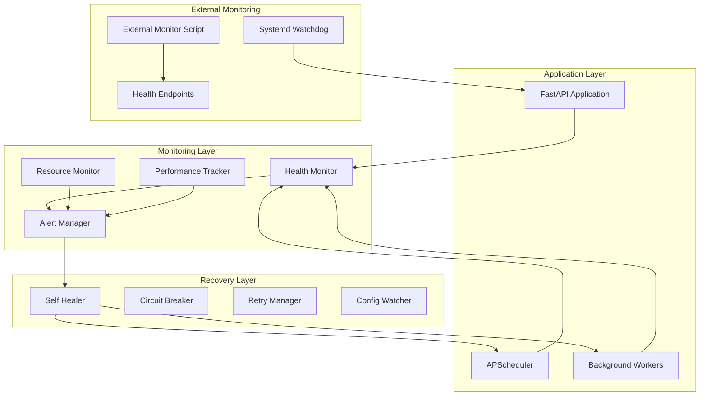
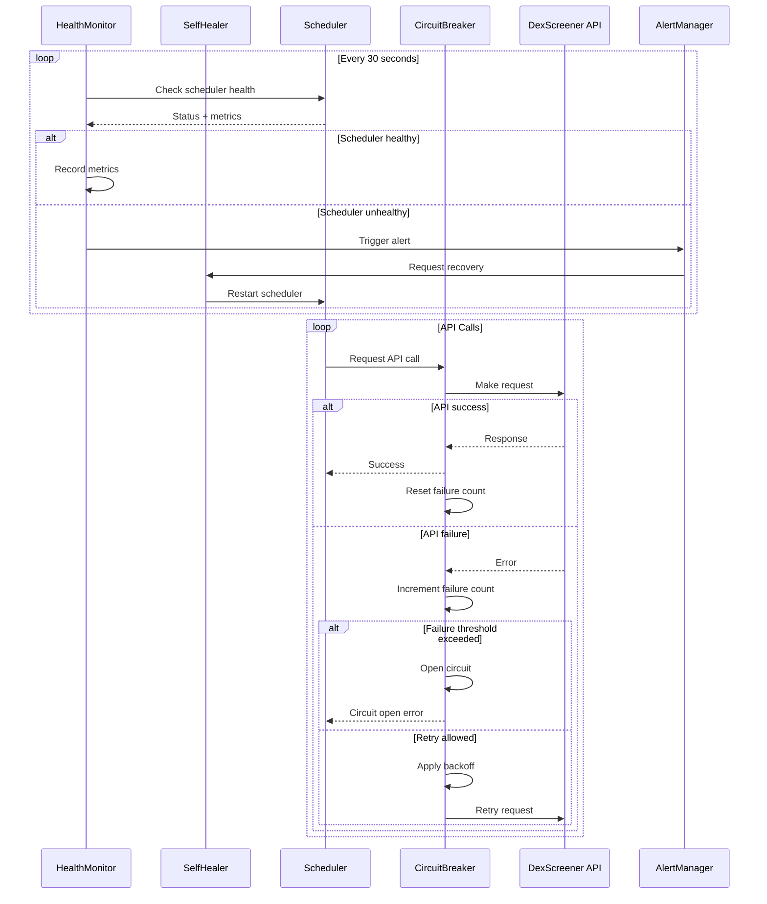

# Design Document

## Overview

This design document outlines the implementation of a comprehensive system stability and monitoring solution for the To The Moon token scoring system. The solution provides proactive monitoring, automatic recovery, resilient external API integration, and graceful degradation under load to ensure 99.9% uptime.

## Architecture

### High-Level Architecture



### Component Interaction Flow



## Components and Interfaces

### 1. Enhanced Health Monitor

**Location:** `src/monitoring/health_monitor.py`

```python
class HealthMonitor:
    def __init__(self):
        self.metrics = HealthMetrics()
        self.alert_manager = AlertManager()
        self.thresholds = HealthThresholds()
    
    async def monitor_scheduler_health(self) -> SchedulerHealth:
        """Monitor scheduler component health"""
        
    async def monitor_resource_usage(self) -> ResourceHealth:
        """Monitor system resource usage"""
        
    async def monitor_api_health(self) -> APIHealth:
        """Monitor external API health"""
        
    def get_comprehensive_health(self) -> SystemHealth:
        """Get complete system health status"""
```

### 2. Self-Healing Scheduler

**Location:** `src/scheduler/self_healing.py`

```python
class SelfHealingScheduler:
    def __init__(self, scheduler: AsyncIOScheduler):
        self.scheduler = scheduler
        self.health_monitor = HealthMonitor()
        self.recovery_actions = RecoveryActions()
    
    async def start_monitoring(self):
        """Start continuous health monitoring and recovery"""
        
    async def handle_scheduler_failure(self, failure_type: str):
        """Handle specific scheduler failure scenarios"""
        
    async def graceful_restart(self, reason: str):
        """Perform graceful scheduler restart"""
        
    async def emergency_restart(self, reason: str):
        """Perform emergency restart when graceful fails"""
```

### 3. Resilient API Client

**Location:** `src/adapters/services/resilient_dexscreener_client.py`

```python
class ResilientDexScreenerClient:
    def __init__(self):
        self.circuit_breaker = CircuitBreaker()
        self.retry_manager = RetryManager()
        self.cache = APICache()
    
    async def get_pairs_resilient(self, mint: str) -> Optional[list[dict]]:
        """Get pairs with full resilience features"""
        
    async def get_pairs_with_retry(self, mint: str, max_retries: int = 3) -> Optional[list[dict]]:
        """Get pairs with retry logic"""
        
    def is_healthy(self) -> bool:
        """Check if API client is healthy"""
```

### 4. Circuit Breaker Implementation

**Location:** `src/monitoring/circuit_breaker.py`

```python
class CircuitBreaker:
    def __init__(self, failure_threshold: int = 5, recovery_timeout: int = 60):
        self.failure_threshold = failure_threshold
        self.recovery_timeout = recovery_timeout
        self.failure_count = 0
        self.last_failure_time = None
        self.state = CircuitState.CLOSED
    
    async def call(self, func: Callable, *args, **kwargs):
        """Execute function with circuit breaker protection"""
        
    def record_success(self):
        """Record successful API call"""
        
    def record_failure(self):
        """Record failed API call"""
        
    def get_state(self) -> CircuitState:
        """Get current circuit breaker state"""
```

### 5. Performance Tracker

**Location:** `src/monitoring/performance_tracker.py`

```python
class PerformanceTracker:
    def __init__(self):
        self.metrics = defaultdict(list)
        self.thresholds = PerformanceThresholds()
    
    def track_api_call(self, duration: float, success: bool):
        """Track API call performance"""
        
    def track_processing_time(self, group: str, duration: float):
        """Track group processing time"""
        
    def get_performance_summary(self) -> PerformanceMetrics:
        """Get comprehensive performance metrics"""
        
    def detect_performance_issues(self) -> List[PerformanceAlert]:
        """Detect performance degradation patterns"""
```

## Data Models

### Health Status Models

```python
@dataclass
class SchedulerHealth:
    status: str  # "healthy", "degraded", "critical"
    hot_group_last_run: datetime
    cold_group_last_run: datetime
    hot_group_processing_time: float
    cold_group_processing_time: float
    tokens_processed_per_minute: float
    error_rate: float
    alerts: List[HealthAlert]

@dataclass
class ResourceHealth:
    memory_usage_mb: float
    cpu_usage_percent: float
    disk_usage_percent: float
    database_connections: int
    open_file_descriptors: int
    status: str

@dataclass
class APIHealth:
    dexscreener_status: str
    average_response_time: float
    error_rate: float
    circuit_breaker_state: str
    cache_hit_rate: float
    requests_per_minute: float
```

### Configuration Models

```python
@dataclass
class MonitoringConfig:
    health_check_interval: int = 30
    resource_check_interval: int = 60
    performance_check_interval: int = 120
    alert_cooldown: int = 300
    
@dataclass
class RecoveryConfig:
    max_restart_attempts: int = 3
    restart_cooldown: int = 300
    graceful_shutdown_timeout: int = 30
    emergency_restart_threshold: int = 600
    
@dataclass
class CircuitBreakerConfig:
    failure_threshold: int = 5
    recovery_timeout: int = 60
    half_open_max_calls: int = 3
```

## Error Handling

### Failure Classification

1. **Transient Failures** (retry with backoff):
   - Network timeouts
   - Rate limiting
   - Temporary API unavailability

2. **Persistent Failures** (circuit breaker):
   - API service down
   - Authentication failures
   - Malformed responses

3. **System Failures** (restart required):
   - Memory leaks
   - Deadlocks
   - Configuration errors

4. **Critical Failures** (manual intervention):
   - Database corruption
   - Disk space exhaustion
   - Security breaches

### Recovery Strategies

```python
class RecoveryStrategy:
    def handle_transient_failure(self, error: Exception) -> RecoveryAction:
        """Handle temporary failures with retry logic"""
        
    def handle_persistent_failure(self, error: Exception) -> RecoveryAction:
        """Handle persistent failures with circuit breaker"""
        
    def handle_system_failure(self, error: Exception) -> RecoveryAction:
        """Handle system-level failures with restart"""
        
    def handle_critical_failure(self, error: Exception) -> RecoveryAction:
        """Handle critical failures requiring manual intervention"""
```

## Testing Strategy

### Unit Tests

1. **Health Monitor Tests**:
   - Test health check logic with various system states
   - Test alert triggering thresholds
   - Test metric collection accuracy

2. **Circuit Breaker Tests**:
   - Test state transitions (CLOSED → OPEN → HALF_OPEN)
   - Test failure counting and recovery timing
   - Test API call protection

3. **Self-Healing Tests**:
   - Test automatic restart scenarios
   - Test graceful vs emergency restart logic
   - Test configuration change detection

### Integration Tests

1. **End-to-End Recovery Tests**:
   - Simulate scheduler failures and verify recovery
   - Test API failures and circuit breaker behavior
   - Test resource exhaustion scenarios

2. **Performance Tests**:
   - Load testing with monitoring enabled
   - Memory leak detection tests
   - API rate limiting tests

### Chaos Engineering Tests

1. **Failure Injection**:
   - Random scheduler job failures
   - Network partition simulation
   - Resource exhaustion simulation
   - Database connection failures

## Deployment Strategy

### Phase 1: Core Monitoring (Week 1)
1. Implement basic health monitoring
2. Add enhanced health endpoints
3. Deploy external monitoring script
4. Configure systemd watchdog

### Phase 2: Self-Healing (Week 2)
1. Implement circuit breaker for DexScreener
2. Add retry mechanisms with backoff
3. Implement graceful scheduler restart
4. Add resource monitoring

### Phase 3: Advanced Features (Week 3)
1. Implement self-healing scheduler
2. Add performance tracking and optimization
3. Implement predictive alerting
4. Add comprehensive logging

### Phase 4: External Integration (Week 4)
1. Integrate with external monitoring tools
2. Set up alerting channels (Slack, email, etc.)
3. Implement chaos engineering tests
4. Performance tuning and optimization

## Monitoring and Alerting

### Key Metrics to Track

1. **Scheduler Metrics**:
   - Group execution frequency
   - Processing time per group
   - Tokens processed per minute
   - Error rates by component

2. **API Metrics**:
   - Response times (avg, p95, p99)
   - Error rates by endpoint
   - Rate limiting incidents
   - Circuit breaker state changes

3. **Resource Metrics**:
   - Memory usage trends
   - CPU utilization patterns
   - Database connection pool status
   - Disk I/O and space usage

4. **Business Metrics**:
   - Token update freshness
   - Score calculation accuracy
   - Data quality indicators
   - User-facing API performance

### Alert Levels

1. **INFO**: Normal operational events
2. **WARNING**: Performance degradation or minor issues
3. **ERROR**: Component failures requiring attention
4. **CRITICAL**: System-wide failures requiring immediate action

This design ensures comprehensive monitoring and automatic recovery capabilities while maintaining system performance and reliability.