# System Architecture

Complete architectural overview of the To The Moon token scoring system, including hybrid momentum model, data quality validation, and monitoring capabilities.

## 🏗️ High-Level Architecture


## 📁 Project Structure

### Backend Components
```
src/
├── app/                    # FastAPI Application Layer
│   ├── main.py            # Application entry point & middleware
│   ├── routes/            # API route handlers
│   │   ├── tokens.py      # Token endpoints
│   │   ├── meta.py        # Health & system endpoints
│   │   ├── settings.py    # Settings management
│   │   ├── admin.py       # Admin operations
│   │   └── logs.py        # Logging endpoints
│   ├── logs_buffer.py     # In-memory log buffer
│   └── spa.py             # SPA serving logic
├── core/                  # Core Utilities
│   ├── config.py          # Application configuration
│   └── json_logging.py    # Structured logging
├── domain/                # Business Logic Layer
│   ├── scoring/           # Scoring Models & Logic
│   │   ├── scoring_service.py      # Unified scoring service
│   │   ├── hybrid_momentum_model.py # Advanced scoring model
│   │   ├── component_calculator.py # Component calculations
│   │   ├── ewma_service.py         # EWMA smoothing
│   │   └── scorer.py               # Legacy scoring logic
│   ├── metrics/           # Metrics aggregation
│   │   ├── dex_aggregator.py       # DEX data aggregation
│   │   └── enhanced_dex_aggregator.py # Enhanced metrics
│   ├── validation/        # Data validation
│   │   ├── data_filters.py         # Data quality validation
│   │   ├── dex_rules.py           # DEX validation rules
│   │   └── quality_settings.py    # Quality configuration
│   └── settings/          # Settings management
├── adapters/              # External Integration Layer
│   ├── db/               # Database Layer
│   │   ├── models.py     # SQLAlchemy models
│   │   ├── base.py       # Database configuration
│   │   └── deps.py       # Database dependencies
│   ├── repositories/     # Data Access Layer
│   │   └── tokens_repo.py # Token data operations
│   └── services/         # External API Clients
│       └── dexscreener_client.py # DexScreener integration
├── scheduler/            # Background Processing
│   ├── service.py        # APScheduler tasks
│   ├── monitoring.py     # Health monitoring
│   ├── fallback_handler.py # Fallback mechanisms
│   └── tasks.py          # Background tasks
└── workers/              # Background Workers
    └── pumpfun_ws.py     # WebSocket worker
```

## 🧮 Hybrid Momentum Scoring Architecture

### Scoring Pipeline


### Component Architecture


### Component Formulas

| Component | Formula | Purpose |
|-----------|---------|---------|
| **Transaction Acceleration** | `(tx_5m/5) / (tx_1h/60)` | Measures trading pace acceleration |
| **Volume Momentum** | `vol_5m / (vol_1h/12)` | Compares recent vs average volume |
| **Token Freshness** | `max(0, (6-hours)/6)` | Bonus for recently migrated tokens |
| **Orderflow Imbalance** | `(buys-sells)/(buys+sells)` | Buy/sell pressure analysis |

### EWMA Smoothing

```
EWMA Formula: new_value = α × current + (1-α) × previous
- α = 0.3 (configurable smoothing parameter)
- Applied to all components and final score
- Reduces volatility and prevents manipulation
- Maintains scoring stability over time
```

## 🔍 Data Quality & Validation System

### Multi-Level Validation


### Validation Levels

1. **Critical Issues** (Block updates):
   - Negative liquidity or transaction counts
   - Invalid data types
   - Missing required fields

2. **Warnings** (Allow with flags):
   - High liquidity but no transactions
   - Many transactions but no price movement
   - Suspicious price change ratios

3. **Quality Filters**:
   - Minimum liquidity thresholds ($500)
   - DEX exclusions (bonding curves)
   - Pool count anomaly detection

### Fallback Mechanisms

```mermaid
graph TD
    A[Data Quality Issue] --> B{Issue Type}
    B -->|Critical| C[Use Emergency Score]
    B -->|Warning| D[Use Degraded Score]
    B -->|Temporary| E[Use Fallback Score]
    
    C --> F[Median of Last 10 Scores × 0.5]
    D --> G[Current Score with Warning Flag]
    E --> H[Average of Recent Scores × 0.7]
    
    F --> I[Continue Processing]
    G --> I
    H --> I
```



## 📊 Scheduler & Monitoring Architecture

### Smart Scheduling System

```mermaid
graph TB
    subgraph "Token Classification"
        HOT[Hot Tokens<br/>smoothed_score ≥ 0.3]
        COLD[Cold Tokens<br/>smoothed_score < 0.3]
    end
    
    subgraph "Update Frequencies"
        HOT_SCHED[Every 30 seconds]
        COLD_SCHED[Every 2 minutes]
    end
    
    subgraph "Health Monitoring"
        HEALTH[Health Monitor]
        STALE[Stale Detection]
        ALERTS[Alert System]
    end
    
    HOT --> HOT_SCHED
    COLD --> COLD_SCHED
    HOT_SCHED --> HEALTH
    COLD_SCHED --> HEALTH
    HEALTH --> STALE
    STALE --> ALERTS
```



### Monitoring Capabilities

- **Scheduler Health**: `/health/scheduler` endpoint
- **Token Freshness**: Automatic stale token detection
- **Group Execution**: Hot/cold group processing monitoring
- **Performance Metrics**: Update frequencies and success rates
- **Data Quality**: Validation success/failure tracking

## 🗄️ Database Architecture

### Enhanced Schema Design

```sql
-- Core token information
CREATE TABLE tokens (
    id SERIAL PRIMARY KEY,
    mint_address TEXT UNIQUE NOT NULL,
    name TEXT,
    symbol TEXT,
    status VARCHAR(20) NOT NULL DEFAULT 'monitoring',
    created_at TIMESTAMP WITH TIME ZONE DEFAULT NOW(),
    last_updated_at TIMESTAMP WITH TIME ZONE
);

-- Enhanced scoring snapshots
CREATE TABLE token_scores (
    id SERIAL PRIMARY KEY,
    token_id INTEGER REFERENCES tokens(id) ON DELETE CASCADE,
    score NUMERIC(10,4),
    smoothed_score NUMERIC(10,4),
    raw_components JSONB,           -- Raw component values
    smoothed_components JSONB,      -- EWMA smoothed components
    scoring_model VARCHAR(50) DEFAULT 'hybrid_momentum',
    metrics JSONB,                  -- Market data with quality flags
    created_at TIMESTAMP WITH TIME ZONE DEFAULT NOW()
);

-- Application settings
CREATE TABLE app_settings (
    key TEXT PRIMARY KEY,
    value TEXT
);

-- Indexes for performance
CREATE INDEX idx_tokens_status ON tokens(status);
CREATE INDEX idx_tokens_mint ON tokens(mint_address);
CREATE INDEX idx_scores_token_created ON token_scores(token_id, created_at DESC);
CREATE INDEX idx_scores_model ON token_scores(scoring_model);
```

### Data Relationships


## 🌐 API Architecture

### RESTful Endpoint Design

```mermaid
graph LR
    subgraph "Health & System"
        H1[GET /health]
        H2[GET /health/scheduler]
        H3[GET /version]
    end
    
    subgraph "Token Operations"
        T1[GET /tokens/]
        T2[GET /tokens/{mint}]
        T3[POST /tokens/{mint}/refresh]
        T4[GET /tokens/{mint}/pools]
    end
    
    subgraph "System Management"
        S1[GET /settings]
        S2[POST /settings]
        S3[GET /logs]
        S4[POST /admin/recalculate]
    end
```

### Enhanced Response Models

```json
{
  "mint_address": "ABC123...",
  "name": "Token Name",
  "symbol": "TKN",
  "status": "active",
  "score": 0.75,
  "raw_components": {
    "tx_accel": 0.8,
    "vol_momentum": 0.7,
    "token_freshness": 0.9,
    "orderflow_imbalance": 0.6,
    "final_score": 0.75
  },
  "smoothed_components": {
    "tx_accel": 0.75,
    "vol_momentum": 0.68,
    "token_freshness": 0.85,
    "orderflow_imbalance": 0.58,
    "final_score": 0.72
  },
  "scoring_model": "hybrid_momentum",
  "metrics": {
    "L_tot": 50000.0,
    "tx_count_5m": 25,
    "volume_5m": 1000.0,
    "data_quality_ok": true,
    "data_quality_issues": []
  },
  "created_at": "2025-09-18T10:00:00+00:00",
  "scored_at": "2025-09-18T10:05:00+00:00"
}
```

## 🔒 Security Architecture

### Security Layers

1. **Input Validation**
   - Pydantic model validation
   - SQL injection prevention via ORM
   - XSS protection via proper encoding

2. **Network Security**
   - Rate limiting on API endpoints
   - CORS configuration
   - Reverse proxy (Nginx) protection

3. **Data Protection**
   - Environment-based secrets
   - Database connection encryption
   - Structured logging (no sensitive data)

4. **Access Control**
   - Read-only public API
   - Network-level admin protection
   - Service isolation

## 🚀 Deployment Architecture

### Production Infrastructure


### Service Management

```bash
# systemd services
tothemoon.service          # Main API server
tothemoon-worker.service   # WebSocket worker

# Process architecture
├── uvicorn (ASGI server)
├── APScheduler (background tasks)
├── WebSocket worker (token monitoring)
└── Database connections (pooled)
```

## 📈 Performance & Scalability

### Performance Optimizations

1. **Database Optimizations**
   - Strategic indexing on query patterns
   - Connection pooling
   - Efficient JOIN operations
   - JSONB for flexible component storage

2. **API Performance**
   - Async request handling
   - Response caching where appropriate
   - Pagination for large datasets
   - Efficient serialization

3. **Background Processing**
   - Smart scheduling (hot/cold groups)
   - Batch processing where possible
   - Rate limiting for external APIs
   - Graceful error handling

### Scalability Considerations

- **Horizontal Scaling**: Stateless API design
- **Database Scaling**: Read replicas for reporting
- **Caching Layer**: Redis for frequently accessed data
- **Load Balancing**: Multiple API instances

## 🔧 Configuration Management

### Environment-Based Configuration

```python
# Core settings
APP_ENV: dev/stage/prod
LOG_LEVEL: INFO/DEBUG
DATABASE_URL: Connection string
SCHEDULER_ENABLED: true/false

# Scoring configuration (runtime via API)
scoring_model_active: hybrid_momentum
w_tx, w_vol, w_fresh, w_oi: Component weights
ewma_alpha: Smoothing parameter
min_score: Threshold for hot/cold classification
```

### Runtime Configuration

- **API-based settings**: `/settings` endpoint
- **Database persistence**: `app_settings` table
- **Hot reloading**: No restart required
- **Validation**: Pydantic model validation

## 🔍 Observability & Monitoring

### Logging Architecture


### Health Monitoring

- **System Health**: `/health` endpoint
- **Scheduler Health**: `/health/scheduler` with detailed metrics
- **Token Freshness**: Automatic stale detection
- **Data Quality**: Validation success rates
- **Performance Metrics**: Response times and throughput

This architecture provides a robust, scalable, and maintainable foundation for the To The Moon token scoring system, with modern development practices and production-ready deployment strategies.